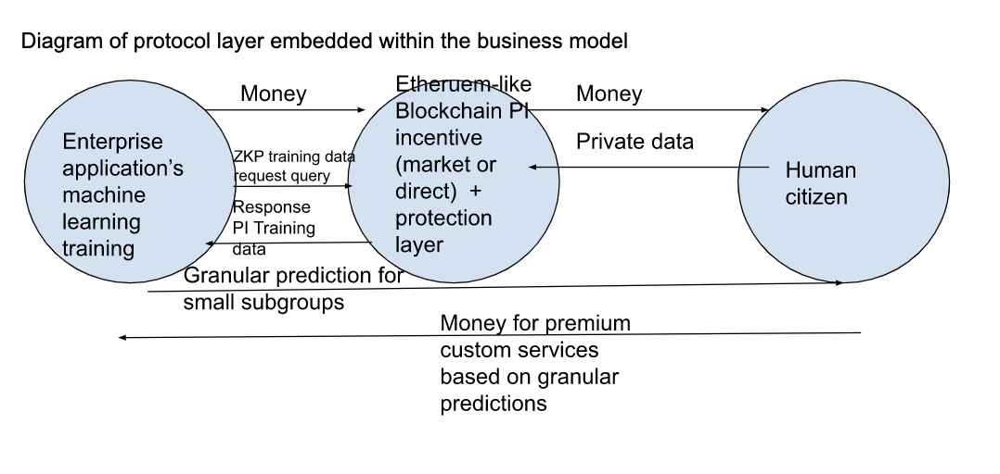

# A new layer for enterprise web applications: ML <--> Blockchain <--> PID

What will be the impact of blockchain on the prediction heterogeniety problem?

In five years enterprise applications with start using a new blockchain layer to get PID (personal information data) in order to train machine learning models to solve the heterogeneity problem. In other words AI prediction accuracy will proven at the very granular subgroup level. This can solve many human problems.

Enterprise web applications need granular predictions to fill the void in high demand services for their customers. 

Granular predictions are not possible because of individual heterogeneity.

The only manner to solve this is to train ML models with private or PID data.

This does not happen because people will not reveal private data. They do not see the gain in prediction as worth the risks they foresee for the loss in privacy.

The world is about to change to change this cost benefits equation.

New tech exists that changes the equation. 

The new tech allow people to be compensated with money and to be confident they will not be exploited.

So when will the world change? 

Questions

When will governments sign off on this new tech?
When will consumers offer their PID on this new tech?
When will enterprises invest in this tech?

For governments and people to sign off, they must have confidence in the money and security, and have a massive gain in better predictions.

The other question is, when will this technology be cheap enough for enterprises to invest?

The current blockchain technology exist but the cost is too high. 

The world is about to change.

The cost

Transaction costs Scale 
ZKP SNARK proof cost

Once an enterprise see the benefits outweigh the costs they will invest in the new layer. 

What is needed for the chain reaction to start?

The variable factor per industry sector is payment of the human for more granular predictions. So my guess is that the sector dealing elderly autonomy, mating and avoiding death through medicine will be first to adopt the layer.

Diagram of protocol layer embedded within the business model

Examples of premium custom services

Who has been cured from diabetes that has the same genetic make up as I?
What Uber drivers have a great reputation my elderly people with poor sight and hearing?
Who wants to marry me even though I have the following genetic makeup?

