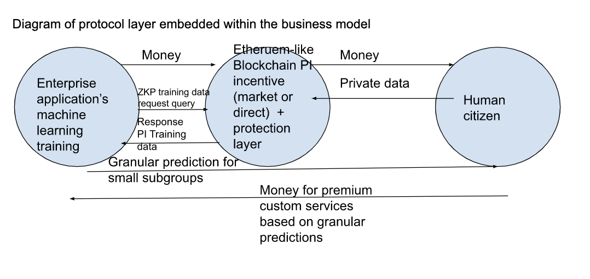

# A new layer for enterprise web applications: ML <--> Blockchain <--> PID

## Examples of high value predictions dependent on granular PID training data

- Who has been cured from diabetes that has the same genetic make up as I?
- What Uber drivers have a great reputation my elderly people with poor sight and hearing?
- Who wants to marry me even though I have the following genetic makeup?

## What will be the impact of blockchain on the prediction heterogeniety problem?

In five years enterprise applications with start using a new blockchain layer to get PID (personal information data) in order to train machine learning models to solve the heterogeneity problem. In other words AI prediction accuracy will proven at the very granular subgroup level. This can solve many human problems.

## Rationale

Enterprise web applications need granular predictions to fill the void in high demand services for their customers. 

Granular predictions are not possible because of individual heterogeneity.

The only manner to solve this is to train ML models with private or PID data.

This does not happen because people will not reveal private data. They do not see the gain in prediction as worth the risks they foresee for the loss in privacy.

The world is about to change to change this cost benefits equation.

New tech exists that changes the equation. 

The new tech allow people to be compensated with money and to be confident they will not be exploited.

So when will the world change? This depends on the timing of three prereq conditions. 

Timing questions

- When will governments sign off on this new tech?
- When will consumers offer their PID on this new tech?
- When will enterprises invest in this tech?

For governments and people to sign off, they must have confidence in the money and security, and have a massive gain in better predictions.

The other question is, when will this technology be cheap enough for enterprises to invest?
Once an enterprise see their potential profits outweigh the costs they will invest in the new layer. 
The current blockchain technology exist but the cost is too high. 

What are the key cost factors for making a new blockchain enterprise PID layer? 

- Ethereum transaction costs must get much lower
- ZKP SNARK proof cost must be much lower

What is needed for the chain reaction to start?

The variable factor per industry sector is the massive variation in premium payments the customer is willing to pay for more granular predictions. So my guess is that the sector dealing critical life needs willm be the first to adopt the new tech.

- elderly autonomy
- mating
- avoiding death through customized medicine

Diagram of protocol layer embedded within the business model

# Awesome websites

# References on personalized medicine

- [TechNation Radio Podcast Episode 23-03 The Right Antidepressant the First Time?](https://podcasts.apple.com/us/podcast/technation-radio-podcast/id876042622?i=1000595534762)
- [The rise of the genome and personalised medicine](https://www.ncbi.nlm.nih.gov/pmc/articles/PMC6297695/)
- [Advancing precision medicine through agile governance](https://www.brookings.edu/research/advancing-precision-medicine-through-agile-governance/)
- [Health Survey for England content](https://digital.nhs.uk/data-and-information/areas-of-interest/public-health/health-survey-for-england---health-social-care-and-lifestyles/survey-content)

# Discoverability - SEO

- DAG of ZKML-PID chain reaction dependencies 
- tweet V. Buterin
- tweet J. Pearl
