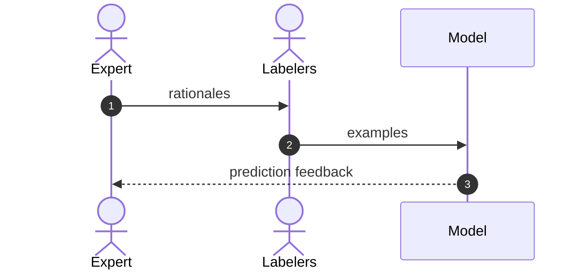

# Fine-tuning ChatGPT to replace human labeling?

This is the first article in a two part series.

1. Fine-tune high level
2. Simple example using keto dish classification 

TLDR: If your AI feature is stuck becaause of bad quality training data you might consider pausing your labeling after reading this.


This is a non-technical overview on moving away from human annotation and towards fine-tuning ChatGPT or other large language models (LLM).

This is a simplification of material you will at these site on the internet... .

In this article we try to provide non-technical high-level overview of how fine-tuning ChatGPT is new and different to conventional human labeling.

Our audience are CTOs that have invest in an AI NLP classifier feature that requires internal domain expertise on some niche prediction problem. 

There is a new situation for CTOs. 

- the consensus is that human labeling kills lots of projects
- new tools have emerged making expensive labeling obsolete
- ChatGPT just lowered the barrier to entry for making AI features; so your competitors are rushing to steal your customers by getting their AI feature working before you

The ultimate problem is the same whether you use human labelers or a LLM -- you need to get your experts domain knowledge into a computational prediction model.

The solution is to iterate

- distill or model your expert's knowledge
- run an experiment
  - train model
  - analyze prediction
- if good enough...launch
- else repeat, and try to do a better job modeling your expert's knowledge and repeat


The purpose of the labeler is to scale your expert.

## Old way 


## New way 

```mermaid
sequenceDiagram
    autonumber
    actor E as Expert
    participant LLM as ChatGPT
    participant M as Fine-tuned ChatGPT
    E->>LLM: rationales
    LLM->>M: examples
    M-->>E: prediction feedback


In the new way the Expert (SME) must collaborate with a new player in the game, the LLM fine-tuning analyst.
```
| Topic                             | Diagram node  | Old                                 | New                                  |
| ----------------------------------| ------------- | ------------------------------------| -----------------------------------  |
| Expert                            | 1             | natural language to human labeler   | natural language to human coder      |
| Labelers                          | 2             | yes                                 | replaced by human coder and chatGPT  |
| Model work                        | 3             | NN                                  | label funcs                          |


| Topic                             | Diagram node  | Old                  | New           |
| ----------------------------------| ------------- | ---------------------| ------------- |
| Representing experts mental model | 1             | natural language     | code          |
| Scale                             | 2             | linear               | resolved      |
| Model architecture                | 3             | fine-tune            | no work       |
| Feedback                          | 3             | slow                 | quick         |
```

## Rationale: Representing the experts mental model

I am not sure there is any magic tech bullet. 

Previously challeng was to get the annotorros to share the SME's mental model through language, and now its 
the SME sharing the mental model with the person running the experiments.


## Examples: Scale comes at a cost (linear)

- Metaphor. Canon vs Drone missile
- scale (training examples) as a function of annotation versus experiments  
- scale human expert but how to scale annotators
- more training
- less inter-annotator agreement (bias)
- speed comes at a cost (noise)
- more QA
- new tooling required

## Prediction Feedback

- nuances of human understanding will not be captured with one initial function
- feedback is faster but still more feedback data means more data to be analyzed


Experimental design 

Cognitive empathy with expert 

Problem 1: expert knowledge is still an issue

- coherence the different mental models among many experts 


## What does Data centric mean?

- expertise moves from R&D neural network architecture to cognitive emapathy and data analysis

# Readings

- [ChatGPT fine-tuning as a service](https://community.openai.com/t/chatgpt-fine-tuning-as-a-service/33803)
- [Better not bigger: How to get GPT-3 quality at 0.1% the cost](https://snorkel.ai/better-not-bigger-how-to-get-gpt-3-quality-at-0-1-the-cost/)
- [Data Centric AI](https://github.com/HazyResearch/data-centric-ai)
