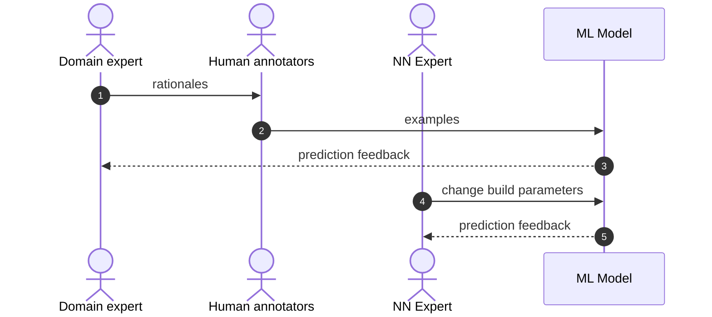
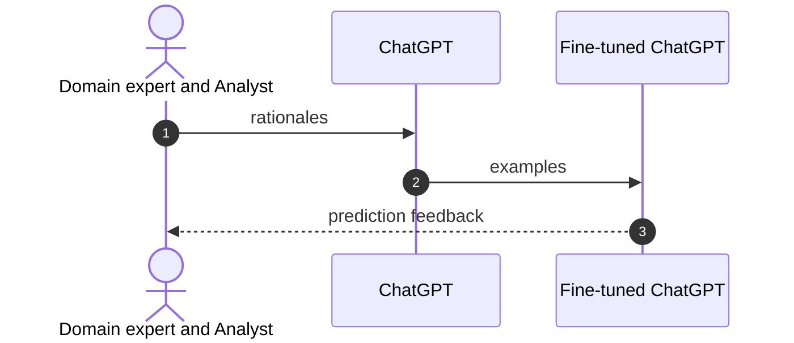

# How ChatGPT will revamp your company's machine learning text classification project

TLDR: If your text classification AI feature is stuck, consider pausing your
project and making a PoC based on fine-tuning ChatGPT.

The software problem we are focused on in this article is building a niche text
classification system. A niche text classification system in one that depends
on domain expertise and data only existing in your business sector or company.
An off-the-shelf LLM, such as ChatGPT, can not provide sufficiently good niche
text classifications unless it is fine-tuned based using the mental model of your
domain experts. Currently, the standard approach is to use human annotators to
label examples in order to train a machine learning model that attempts to
represent the mental model of a company's domain experts. In this article we
conjecture how fine-tuning ChatGPT will force a fundamental change in how ML projects are organized.
Fine-tuning ChatGPT model can replace both human annotation, as well as R&D on ML model
optimizations, but at the risk that comes with organizational change. 

This is the first article in a two part series. In next article we will walk
through an example of fine-tuning.

Some things will not change with ChatGPT. The root problem is the you need to
get your experts domain knowledge into a computational prediction model. This
remains the same whether you use human annotators or fine-tune ChatGPT to make
your niche text classifier. Also the experimental or iterative nature of the
solution is the same whether you use human annotators or fine-tune ChatGPT. 
Here are the simplified steps:

1. distill your expert's mental models into labeled examples
2. train a computer model with the labeled examples
3. analyze the resulting predictions
4. if good enough...launch...else figure out where you missed in modeling your expert's knowledge, then repeat above

## Some factors of garbage output from human annotation systems

The purpose of human annotators is to scale your expert to train the model
faster. The problem is that it not trivial to transfer the mental model of your
expert to the human annotators. In addition, there is a large time lag to get
feedback on success. 

## Old way to run one experiment 


## New way to run one experiment




### Summary of big differences

| Topic                             | Diagram node  | Old                     | New                                  |
| ----------------------------------| ------------- | ------------------------| -------------------------------------|
| Representing expert's mental model| 1             | natural language        | code                                 |
| Human annotation                  | 2             | yes                     | replaced by human coder and chatGPT  |
| Training examples                 | 2             | slow, hard to reproduce | fast, easy to reproducible                          |
| Feedback                          | 3             | slow                    | quick, but more complex analysis     |
| Model architecture                | 4,5           | expensive optimizations | replaced by ChatGPT external service |


## A new relationship: the expert and the analyst

The fine-tuning analyst is a new player in the game.
The analyst transforms the experts rationales into code that creates examples
to train or fine-tune ChatGPT. The analyst then reports the results back to the
expert to see how they can improve the predictions through a more nuanced
understanding of the expert's mental model.

```mermaid
flowchart LR
    E((Expert))-- rationales -->A((Analyst))
    A((Analyst))-. reports .->E((Expert))

Success will depend on collaboration between domain expert and the fine-tuning
analyst. This is a new relationship that did not exist before and will demand a
different skill set.

How is the fine-tuning analyst of the new way different from the NN optimization scientist of the old way? 

- The analyst works more intensely with the expert, which will require cognotive emapthy skills.
- The analyst does not need a sophisticed knowledge of the neural network architecture.
- The analyst performs heavy exploratory data analysis. [Here](https://hbr.org/2018/12/what-great-data-analysts-do-and-why-every-organization-needs-them) is a nice article explaining how this part of data science is different.

## A decision framework on whether to jump ship to the new approach

We propose a PoC experiment to determine if the cost to get to benchmark is cheaper with a fine-tuning analyst then human annotators and ML NN expert.

# Readings

- [ChatGPT fine-tuning as a service](https://community.openai.com/t/chatgpt-fine-tuning-as-a-service/33803)
