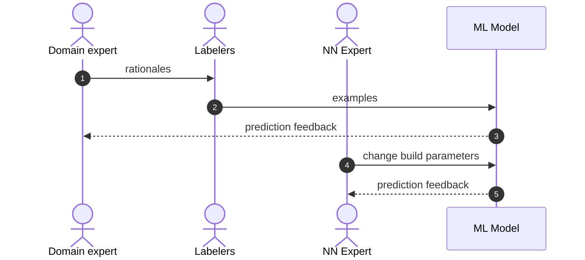

# A new AI development model: Fine-tuning ChatGPT to replace human labeling and optmization R&D

This is the first article in a two part series.

1. Fine-tune high level
2. Simple example using keto dish classification 

TLDR: If your AI feature is stuck becaause of bad quality training data you might consider pausing your labeling after reading this.

This is a non-technical overview on moving away from human annotation and towards fine-tuning ChatGPT or other large language models (LLM).

This is a simplification of material you will at these site on the internet... .

In this article we try to provide non-technical high-level overview of how fine-tuning ChatGPT is new and different to conventional human labeling.

Our audience are CTOs that have invest in an AI NLP classifier feature that requires internal domain expertise on some niche prediction problem. 

There is a new situation for CTOs. 

- the consensus is that human labeling kills lots of projects
- new tools have emerged making expensive labeling obsolete
- ChatGPT just lowered the barrier to entry for making AI features; so your competitors are rushing to steal your customers by getting their AI feature working before you

The ultimate problem is the same whether you use human labelers or a LLM -- you need to get your experts domain knowledge into a computational prediction model.

The solution is to iterate

- distill or model your expert's knowledge
- run an experiment
  - train model
  - analyze prediction
- if good enough...launch
- else repeat, and try to do a better job modeling your expert's knowledge and repeat

The purpose of the labeler is to scale your expert.

## Old way to run one experiment 

## New way to run one experiment

In the new way the Expert (SME) must collaborate with a new player in the game, the LLM fine-tuning analyst.

| Topic                             | Diagram node  | Old                     | New                     |
| ----------------------------------| ------------- | ------------------------| ------------------------|
| Expert                            | 1             | natural language to human labeler   | natural language to human coder      |
| Representing experts mental model | 1             | natural language        | code                    |
| Labelers                          | 2             | yes                                 | replaced by human coder and chatGPT  |
| Training examples                 | 2             | slow, ambiguous to repro| fast, repro             |
| Feedback                          | 3             | slow                    | quick, complex analysis |
| Model work                        | 3             | NN                                  | label funcs                          |
| Model architecture                | 4,5           | expensive optimizations | no work                 |

## Rationale: Representing the experts mental model

Unique collaboration requriements

I am not sure there is any magic tech bullet. 

Previously challeng was to get the annotorros to share the SME's mental model through language, and now its 
the SME sharing the mental model with the person running the experiments.

- nuances of human understanding will not be captured with one initial function
- feedback is faster but still more feedback data means more data to be analyzed
- Metaphor. Canon vs Drone missile
- new tooling required

# Readings

- [ChatGPT fine-tuning as a service](https://community.openai.com/t/chatgpt-fine-tuning-as-a-service/33803)
