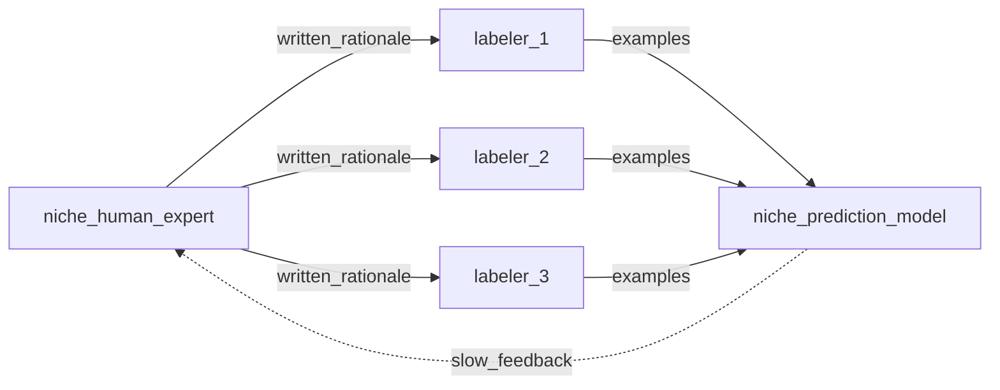
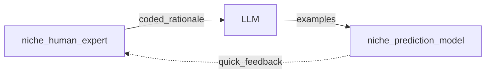
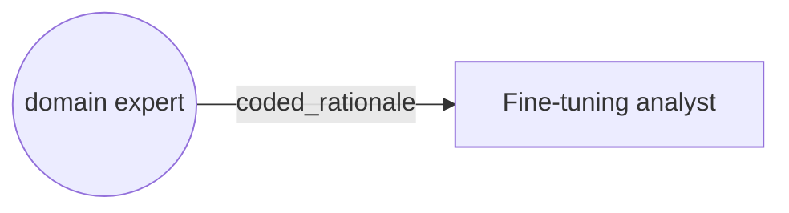

# Questions

1. What are the best readings?
2. What are the best tools?
3. What are best channels Medium article, xyz, and linkedin post, and tweet?

## Old way (deprecated diagram) 

## New way (deprecated diagram) 

## New way (deprecated diagram) 

# High priority TODOs

- [ ] [Read OpenAI on fine-tuning ChatGPT](https://platform.openai.com/docs/introduction)
- [ ] Read all of Snorkle's readings and examples 

# LLMs

LLMs are synonomous with foundational NLP models.

- Roberta
- OpenAI's ChatGPT
- Google's ...

# Low priority TODOs

- [ ] Checkout [AIWORK](https://aiwork.io/)
- [ ] Google Ad experiments

# Readings

- [Better not bigger: How to get GPT-3 quality at 0.1% the cost](https://snorkel.ai/better-not-bigger-how-to-get-gpt-3-quality-at-0-1-the-cost/)
- [Data Centric AI](https://github.com/HazyResearch/data-centric-ai)

# Futuristic ideas

- This is not necassitrily bad for human annotation companies. They can train their workers on pandas and exporatory data analysis. Perhaps outsourcing human labeling will be replaced with outsourcing programitic labeling.
- gamification ...baseline
- economic markets ...incentive to work on diff sections of a prediction problem  .....DRIFT

# Glossary

- programmatic labeling
- labeling functions
- Snorkel Flow app
- [Snorkle Blog](https://www.snorkel.org/blog/)
- SFT (Supervised Fine-Tuned) model
- [PPO (Proximity Policy Optmization)](https://openai.com/blog/openai-baselines-ppo/)

# Toy PoC: Classify a food dish as Keto or not.

- What does Keto mean? High quality omega-3 fats and low glycmic carbs (net carbs).
- Make Golden Test set of examples.
- Can an off the shelf ChatGPT classify food dishes as omega-3? 
- Can an off the shelf ChatGPT classify food dishes as low glycmic?
- Run ER for keto dishes.
- Did it work?
- What will it take to fine-tune it?
- Examples for Classifier 1: omega-3 fats?
- Examples for Classifier 2: low gycmic (net carbs)?
- Did it work?

# Other potential PoCs

- Can ChatGPT do causal inference? Use Book of Why? (J. Pearl) firing squad text. Add causal DAG and then try couterfactual reasoning ....from J Pearl
- Fine tune GraphGPT

# Consulting 

### Potential Landing page or Google Ads Promotional ideas 

- We are looking for companies whose AI project is stuck because of garbage input data.
- Bad prediction performance can't be fixed with sophisticated ML R&D when the training data is garbage.
- garbage in, garbage out
- labeling quality
- does your pipeline require heavy manual work before data releases?
- lots of labeling but still poor predictions?
- data quagmire rescue
- data pipelines get clogged with garbage input
- Mr CEO, How much $ have you burned on your AI project?
- if benchmark met, max you pay is .33 of what was burned b4 starting the project
- Free consultation
- Cost = 1/3 of the $$$ you have burned
- Don't contact us unless you have already failed.

## Consulting success factors

- get in front of CTOs
- get traction
- the story of past failure

## Notes based on chat with Shawn Feb 3

- [Snorkle AI](https://snorkel.ai/) -- checkout videos from conferences
-- Programmatic Labeling
-- Foundational Models
-- Use Case Examples
- Data centric AI
- Get paid based on how far we beat benchmark
- Stuggling NLP
- C-suite level access needed to get traction
- Leveraging Foundational Model - Fine-tune
- Functions
- Weak labeling
- Weak supervision

# Readings

- [ChatGPT fine-tuning as a service](https://community.openai.com/t/chatgpt-fine-tuning-as-a-service/33803)
- [Better not bigger: How to get GPT-3 quality at 0.1% the cost](https://snorkel.ai/better-not-bigger-how-to-get-gpt-3-quality-at-0-1-the-cost/)
- [Data Centric AI](https://github.com/HazyResearch/data-centric-ai)
