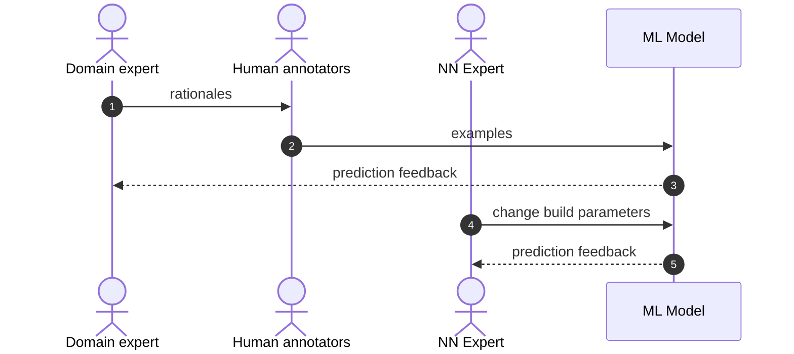
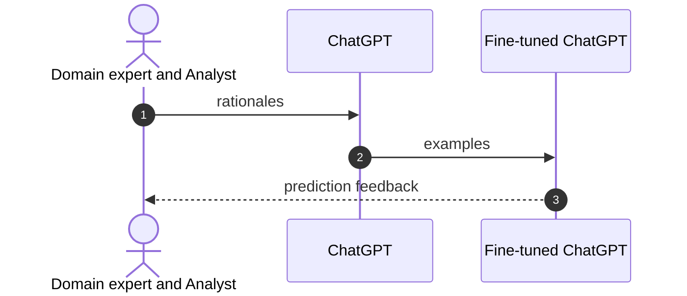
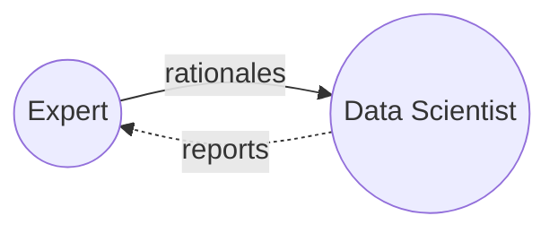

# Writing

- [Write for Towards Data Science](https://towardsdatascience.com/questions-96667b06af5)
- [Can You Co-Author a Medium Story?](https://medium.com/menlo-office/can-you-co-author-a-medium-story-6b7422e877ca)

# Ideas

- Domain Driven Design
- The data science new role of the LLM fine-tuner will depend DDD.
-

# Searched "Towards Data Science AND domain driven design"

- [How to Implement Domain-Driven Design (DDD) in Golang](https://medium.com/towards-data-science/how-to-implement-domain-driven-design-ddd-in-golang-2e2139beb09d)
- [What is Domain-Driven Design?](https://medium.com/towards-data-science/what-is-domain-driven-design-5ea1e98285e4)

# what percentage of ai projects fail?

https://www.montecarlodata.com/blog-why-production-machine-learning-fails-and-how-to-fix-it/

In October 2020, Gartner reported that only 53% of projects make it from
prototype to production—and that’s at organizations with some level of AI
experience. For companies still working to develop a data-driven culture, that
number is likely far higher, with some failure-rate estimates soaring to nearly
90%.

- Misalignment between actual business needs and machine learning objectives

AI engineering stands on three core pillars — DataOps, ModelOps and DevOps.

According to Gartner, 85% of machine learning projects fail[1][2]. Other sources
report similar statistics for AI projects[1][3][4]. VentureBeat reported in 2019
that nearly 90% of machine learning models never make it into production[5].

1. https://www.aidatatoday.com/top-10-reasons-why-ai-projects-fail/
2. https://www.iiot-world.com/industrial-iot/connected-industry/why-85-of-machine-learning-projects-fail/
3. https://www.infoworld.com/article/3639028/why-ai-investments-fail-to-deliver.html
4. https://www.forbes.com/sites/cognitiveworld/2022/08/14/the-one-practice-that-is-separating-the-ai-successes-from-the-failures

# Use GPT-3 to jump start your AI text classifier, and save your company money

- Rethinking the costs of developing an NLP AI classification feature: Speculating on the impact of GTP-3 and Snorkle
- Opportunity cost of not is loosing customer
- The emergence of the fine-tuning data scientist: a new role for enterprise AI

Two new situations

- AI as a service - fine-tuning GPT-3 models
- Programmatic labeling analysis as a service - Snorkle

## Caveats

This is for design thinking and use case exploration to spur innovation.

## TLDR

If your AI feature is based on a text classification model, consider making a
PoC by fine-tuning ChatGPT instead of building your own ML model from scratch.
Fine-tuning ChatGPT can solve the following problems.

- bad labeling quality
- slow labeling speed
- no NN expertise
- no MLOps expertise

# OpenAI's Fine-tune API

Now you can fine-tune these OpenAI models: davinci, curie, babbage, and ada.

How will this paper provide more information that Open AI's official doc and example?

- [Open AI's Fine-tuning doc](https://platform.openai.com/docs/guides/fine-tuning)
- [Open AI's Fine tuning classification example](https://github.com/openai/openai-cookbook/blob/main/examples/Fine-tuned_classification.ipynb)

## Shawn's comments

- Show results of an example use case up front, and show comparison benchmark
- MAIN POINT of passive labeling --- Speeding 10X labeling
- A LOT OF POEPLE WONT BUY INTO WEAK LABELING

## The problem

The software problem we are focused on in this article is building a niche text
classification system. The purpose of a niche text classification system is to scale 
the mental model of a domain expert. For example...

Currently, the standard approach is to use human annotators to
label examples in order to train a machine learning model that attempts to
represent the mental model of a company's domain experts.

Some things will not change with ChatGPT. The root problem is the you need to
get your experts domain knowledge into a computational prediction model. This
remains the same whether you use human annotators or fine-tune ChatGPT to make
your niche text classifier. Also the experimental or iterative nature of the
solution is the same whether you use human annotators or fine-tune ChatGPT. 
Here are the simplified steps:

1. distill your expert's mental models into labeled examples
2. train a computer model with the labeled examples
3. analyze the resulting predictions
4. if good enough...launch...else figure out where you missed in modeling your expert's knowledge, then repeat above

## Human annotation problems

### garbage output

The purpose of human annotators is to scale your expert to train the model
faster. The problem is that it not trivial to transfer the mental model of your
expert to the human annotators. In addition, there is a large time lag to get
feedback on success. 

# Step through an example

is a food dish keto

## Fine-tuning versus good prompt design

An off-the-shelf LLM, such as ChatGPT, can not provide sufficiently good niche
text classifications unless it is fine-tuned based using the mental model of your
domain experts. 

# Fine-tuning ChatGPT will restructure data science teams

In this section we speculate on how fine-tuning ChatGPT will force a fundamental change in how ML projects are organized.
Fine-tuning ChatGPT model can replace both human annotation, as well as R&D on ML model
optimizations, but at the risk that comes with organizational change. 

## Old way to run one experiment 

## New way to run one experiment

### Summary of big differences

| Topic                             | Diagram node  | Diff: how new replaces old                                                |
| ----------------------------------| ------------- | ----------------------------------------------------------------------|
| Representing expert's mental model| 1             | coded rationales replaces natural language rationales                 |
| Human annotation                  | 2             | the fine-tuning analyst replaces the human annotators                 |
| Training examples                 | 2             | a fast, reproducible process replaces a slow, non-reproducible one    |
| Feedback                          | 3             | quick, but more complex feedback analysis replaces a slow, simple one |
| Model architecture                | 4,5           | external service makes obsolete the expensive NN R&D optimization work|

??| MLOps for model deploy            | 4             | external service makes obsolete the MLOps deployment work obsolete    |

## A new relationship: the expert and the analyst

The fine-tuning analyst is a new player in the game.
The analyst transforms the experts rationales into code that creates examples
to train or fine-tune ChatGPT. The analyst then reports the results back to the
expert to see how they can improve the predictions through a more nuanced
understanding of the expert's mental model.

Success will depend on collaboration between domain expert and the fine-tuning
analyst. This is a new relationship that did not exist before and will demand a
different skill set.

How is the fine-tuning analyst of the new way different from the NN optimization scientist of the old way? 

- The analyst works more intensely with the expert, which will require cognotive emapthy skills.
- The analyst does not need a sophisticed knowledge of the neural network architecture.
- The analyst performs heavy exploratory data analysis. [Here](https://hbr.org/2018/12/what-great-data-analysts-do-and-why-every-organization-needs-them) is a nice article explaining how this part of data science is different.

## A decision framework on whether to jump ship to the new approach

We propose a PoC experiment to determine if the cost to get to benchmark is cheaper with a fine-tuning analyst then human annotators and ML NN expert.

# Readings

- [ChatGPT fine-tuning as a service](https://community.openai.com/t/chatgpt-fine-tuning-as-a-service/33803)
