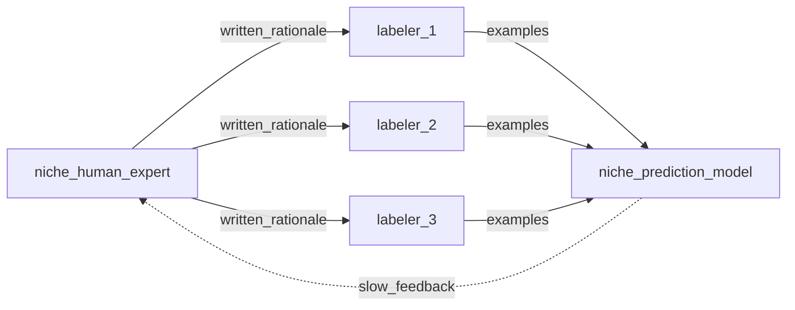
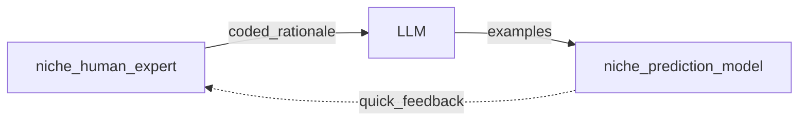

# Pause your labeling: A non-technical look at fine-tuning ChatGPT to rescue your AI feature

Our audience are CTOs that have invest in an AI NLP classifier feature that requires internal domain expertise on some niche prediction problem. 

You have a niche NLP prediction problem if an off-the-shelf version of ChatGPT has no value to you in. Its was never trained on the 
langauge and reasoning of your business niche.

There is a new situation for CTOs. 

- the consensus is that human labeling kills lots of projects
- new tools have emerged making expensive labeling obsolete
- ChatGPT makes NLP AI comprehensible and lowered the barrier to entry for making AI features

This is a non-technical overview on moving away from human annotation and towards fine-tuning ChatGPT or other large language models (LLM).

The ultimate problem is to get your experts domain knowledge into a computational prediction model.

# Problems

1. distill or model your expert knowledge
2. iteratively get training data for estimating models parameters (HITL observability emngineering)

The purpose of the labeler is to scale your expert.

## Old way 

## New way

Problem 1: expert knowledge is still an issue

- coherence the different mental models among many experts 

Solved the iteration speed 
but still have problem 1
plus a new sub-problem -- how to tranfer expertise (rationales) into code ...this will be harder than product team writing annotation guidelines

Data centric

- data analysis over R&D neural network architecture and finetuning
- cognitive emapathy (praticality) over mathematics

# LLMs

LLMs are synonomous with foundational NLP models.

- Roberta
- OpenAI's ChatGPT
- Google's ...

# Questions

1. What are the best readings?
2. What are the best tools?
3. Can intergrating a causal inference DAGs be an innovation?
4. What are my bottlenecks (cost, complexity, time, traction)?
5. Ask Shawn....Robert as co-author

# High priority TODOs

- [ ] Non-tech explanation as Medium article, xyz, and linkedin post, and tweet.
- [ ] Google Ad experiments
- [ ] [OpenAI](https://platform.openai.com/docs/introduction)
- [ ] Read all of Snorkle's readings and examples 

# Low priority TODOs

- [ ] Checkout [AIWORK](https://aiwork.io/)

# Readings

- [Better not bigger: How to get GPT-3 quality at 0.1% the cost](https://snorkel.ai/better-not-bigger-how-to-get-gpt-3-quality-at-0-1-the-cost/)
- [Data Centric AI](https://github.com/HazyResearch/data-centric-ai)

# Glossary

- programmatic labeling
- labeling functions
- Snorkel Flow app
- [Snorkle Blog](https://www.snorkel.org/blog/)
- SFT (Supervised Fine-Tuned) model
- [PPO (Proximity Policy Optmization)](https://openai.com/blog/openai-baselines-ppo/)

# Toy PoC: Classify a food dish as Keto or not.

- What does Keto mean? High quality omega-3 fats and low glycmic carbs (net carbs).
- Make Golden Test set of examples.
- Can an off the shelf ChatGPT classify food dishes as omega-3? 
- Can an off the shelf ChatGPT classify food dishes as low glycmic?
- Run ER for keto dishes.
- Did it work?
- What will it take to fine-tune it?
- Examples for Classifier 1: omega-3 fats?
- Examples for Classifier 2: low gycmic (net carbs)?
- Did it work?

# Other potential PoCs

- Can ChatGPT do causal inference? Use Book of Why? (J. Pearl) firing squad text. Add causal DAG and then try couterfactual reasoning ....from J Pearl
- Fine tune GraphGPT

# Consulting 

### Potential Landing page or Google Ads Promotional ideas 

- We are looking for companies whose AI project is stuck because of garbage input data.
- Bad prediction performance can't be fixed with sophisticated ML R&D when the training data is garbage.
- garbage in, garbage out
- labeling quality
- does your pipeline require heavy manual work before data releases?
- lots of labeling but still poor predictions?
- data quagmire rescue
- data pipelines get clogged with garbage input
- Mr CEO, How much $ have you burned on your AI project?
- if benchmark met, max you pay is .33 of what was burned b4 starting the project
- Free consultation
- Cost = 1/3 of the $$$ you have burned
- Don't contact us unless you have already failed.

## Consulting success factors

- get in front of CTOs
- get traction
- the story of past failure

## Notes based on chat with Shawn Feb 3

- [Snorkle AI](https://snorkel.ai/) -- checkout videos from conferences
-- Programmatic Labeling
-- Foundational Models
-- Use Case Examples
- Data centric AI
- Get paid based on how far we beat benchmark
- Stuggling NLP
- C-suite level access needed to get traction
- Leveraging Foundational Model - Fine-tune
- Functions
- Weak labeling
- Weak supervision

# First article in a series? What next then?

- How can an SME inject a causal DAG into the LLM so we can ask counter factuals?
