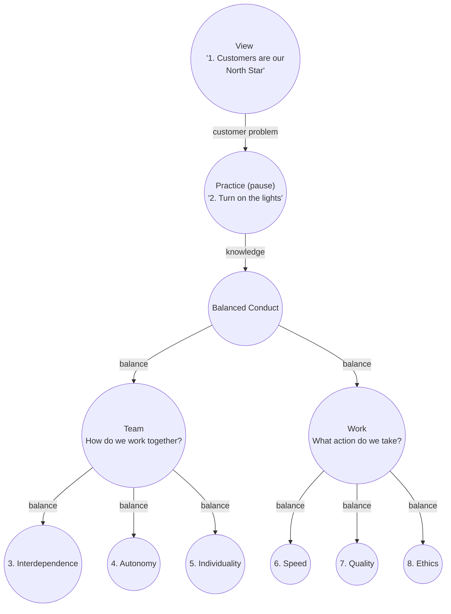

# Zillow in a nutshell

## References

- [story](https://www.zillowgroup.com/about-us/story)
- [values](https://www.zillow.com/careers/our-values/)

## Two phase history of product

Customer journey starts with the Home search and ends with closing.

- Phase 1:  Zestimate real estate prediction valuation service. 
- Phase 2 (now):  real estate transaction service

## Core values 

### Distilling Zillow's eight core values into three parts

The below three way split was inspired Buddhism.

1. The View - Purpose - customer
2. The Practice - have an open state of mind - put on the light - use all information
3. The Conduct - two balancing trilemmas
    a. trilemma to balance -> speed, quality, ethics
    b. trilemma to balance -> autonomy, interdependence, individuality 
  
### Distilling Zillow's eight core values into a flow chart diagram

### Zillow's eight values mapped to my mental model

#### Basic truths

- [ ] Customers Are Our North Star - Avoid XY problem, question ROI on the customer
- [ ] Turn On the Lights - Information to Avoid waste. XY problem, think big picture

#### Trilemma: Balance speed, quality and whats right (ethics)

- [ ] Think Big, Move Fast -- choose low-hanging business fruit 
- [ ] Do the Right Thing - ethics
- [ ] Deliver Quality on Time, Every Time -- balance speed and quality for customer 

#### Trilemma: Balance of autonomy, team work, and individualism (diversity)

- [ ] Include and Empower - fairness, diversity, individualism, no tyranny of the masses
- [ ] Better Together -- Interdependence, Team work
- [ ] Own It - autonomy and accountability

### Leadership guide

"We know that empathetic and effective leadership is critical to creating and maintaining a world-class work culture"

- [ ] Build Relationships Based on Trust, Transparency and Shared Success.
- [ ] Foster an Environment Where All Can Thrive, Today and Tomorrow.
- [ ] Act Decisively and Strategically.
- [ ] Create Clarity from Ambiguity.
- [ ] Expect the Best from Self and Others.
