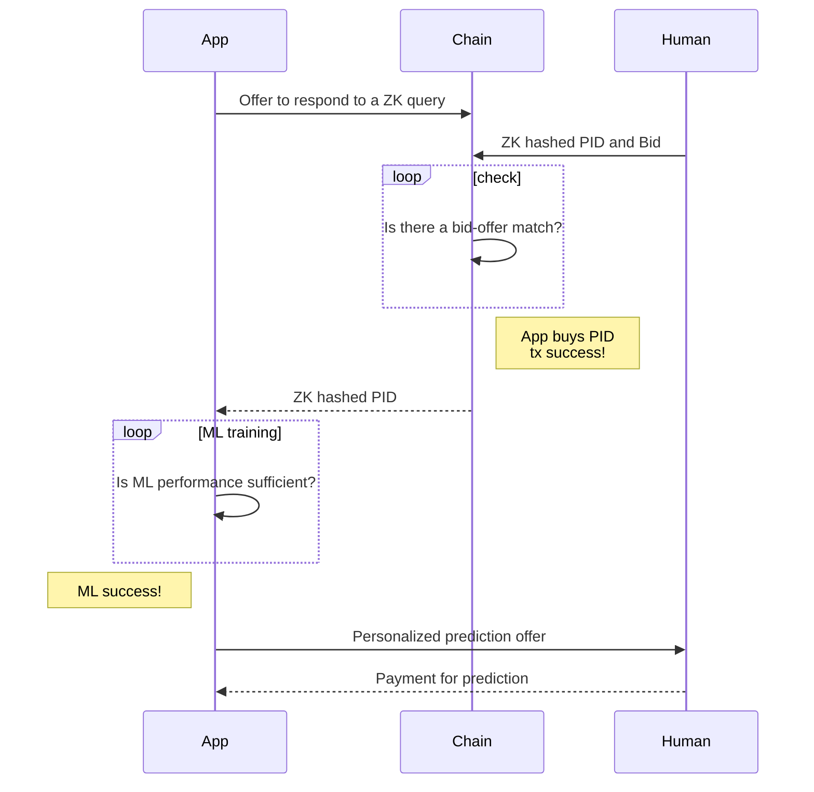

# ZKML will be a new layer for enterprise web applications that will depend on PID

What price would you pay to get these questions answered.

- Tell me, given my child's genes and biomarkers, and the history of other with the same chronic disease, what step should I take next?
- Tell me, given my dad's genes and biomarkers, and the history of similiar people, how can I reverse his memory loss?
- Tell me, given my mom's elderly age and bad hearing, who will be her best Uber driver?

The answers to these questions depend on precision, personalized predictions.

Since people will pay a very high premium for these predictions, why do enterprises not try to profit from developing machine learning models
that make these precision, personalized predictions?

The blocker is that companies need personal information data (PID) to develop such precision predictions.
People will not share PID until they see the benefits outweighing the privacy risks.

As a solution, in order to charge premium prices to the consumer for these precision predictions, enterprises will use a new PID blockchain zero-knowledge (ZK) layer in their application stack to provide the consumer with privacy protection and market incentives to share their PID. 

Once an enterprise sees their potential profits outweigh the costs they will invest in the new blockchain PID layer. 

Factors of adoption 

- When will governments sign off on this new tech?
- When will consumers offer their PID on this new tech?
- When will enterprises invest in this tech?
- Ethereum transaction costs must get much lower
- ZKP SNARK proof cost must be much lower

The variable factor per industry sector is the massive variation in premium payments the customer is willing to pay for more granular predictions. So my guess is that the sector dealing critical life needs willm be the first to adopt the new tech.

- elderly autonomy
- mating
- avoiding death through customized medicine

In five years enterprise applications will start using a new blockchain layer to get PID (personal information data) in order to train machine learning models to solve the precision, perosnalized prediction problem.

## Protocol sequence diagram

## References

- https://gist.github.com/martinwoodward/8ad6296118c975510766d80310db71fd

## Awesome websites

## References on personalized medicine

- [TechNation Radio Podcast Episode 23-03 The Right Antidepressant the First Time?](https://podcasts.apple.com/us/podcast/technation-radio-podcast/id876042622?i=1000595534762)
- [The rise of the genome and personalised medicine](https://www.ncbi.nlm.nih.gov/pmc/articles/PMC6297695/)
- [Advancing precision medicine through agile governance](https://www.brookings.edu/research/advancing-precision-medicine-through-agile-governance/)
- [Health Survey for England content](https://digital.nhs.uk/data-and-information/areas-of-interest/public-health/health-survey-for-england---health-social-care-and-lifestyles/survey-content)

BigchainDB

https://www.bigchaindb.com/

## Discoverability - SEO

- DAG of ZKML-PID chain reaction dependencies 
- tweet V. Buterin
- tweet J. Pearl

- Other ZKML ideas

- Claim your home on Blockchain
- LinkedIn on Blockchain - export PDF 

Shipyard grants

https://oceanprotocol.com/shipyard

How Does Ocean Compute-to-Data Relate to Other Privacy-Preserving Approaches?

https://blog.oceanprotocol.com/how-ocean-compute-to-data-relates-to-other-privacy-preserving-technology-b4e1c330483

How Ocean Protocol will Change the World’s Data Economy | Review

https://medium.datadriveninvestor.com/ocean-protocol-will-change-the-data-economy-blockchain-review-d48a3988296b

- awesome ZKML
- ZK Machine Learning, A tutorial amnd demo by Horace Pan ... etc
